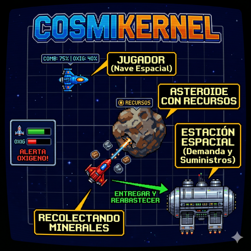

# CosmiKernel

## Introducción

Estás al mando de una nave espacial minera que explora asteroides en busca de recursos. Las estaciones espaciales del sector demandan distintos recursos y pagan bien por ellos. Debes cuidar tu combustible, ya que lo necesitas tanto para trasladarte como para extraer recursos. Además, es fundamental mantener bajo control el nivel de oxígeno de la nave.

## Objetivos

El objetivo de este trabajo es aplicar en el desarrollo de un juego diversos conceptos de Sistemas Operativos como gestión de procesos e hilos, sincronización, comunicación entre procesos, entrada/salida y sistemas de archivos.

## Descripción general del juego

El juego se desarrolla en un mapa bidimensional representado mediante caracteres. En el escenario se encuentran:

### Naves espaciales

* Exploran el espacio en busca de asteroides con recursos.
* Consumen combustible al desplazarse y al extraer recursos.
* Consumen oxígeno de manera periódica.
* Transportan los recursos recolectados para venderlos en estaciones espaciales.

### Estaciones espaciales

* Funcionan como centros de compra y venta de recursos.
* Permiten recargar combustible y oxígeno.
* Consumen combustible de manera periódica.
* Cuando el nivel de combustible baja de un determinado umbral, envían mensajes a las naves del cuadrante solicitando provisiones de deuterio.
* Poseen hangares con capacidad limitada para recibir naves (máximo 3 naves).

### Asteroides

Los asteroides contienen cantidades abundantes pero finitas de recursos:

* **Deuterio**: combustible utilizado por naves y estaciones.
* **Mutexio**.
* **Semaforita**.
* **Kernelio**.

No todos los asteroides contienen necesariamente los cuatro recursos ni las mismas cantidades.

## Arquitectura

El proyecto sigue una arquitectura cliente-servidor.

### Servidor

Un proceso servidor administra:

* El mapa del sector espacial.
* La ubicación de naves y estaciones.
* La información de los asteroides.
* Los recursos disponibles en el escenario.

### Clientes

Los clientes son las naves espaciales y las estaciones espaciales.

#### Estaciones espaciales

Cada estación se ejecuta como un proceso independiente que:

* Se conecta al servidor.
* Gestiona un hangar con capacidad máxima para tres naves.
* Consume combustible periódicamente.
* Realiza transacciones de compra y venta.
* Envía mensajes a las naves cuando requiere combustible.

#### Naves espaciales

Cada nave se ejecuta como un proceso independiente y utiliza múltiples hilos:

* **Soporte vital**: administra y reduce periódicamente el nivel de oxígeno.
* **Propulsión**: controla el movimiento y el consumo de combustible.
* **Extracción**: administra la extracción de recursos y el consumo de combustible asociado.
* **Radar**: mantiene actualizada la visualización del mapa utilizando la información proporcionada por el servidor.

## Memoria compartida

El mapa del juego reside en una memoria compartida POSIX. Esto permite que:

* El servidor mantenga el estado global del escenario.
* Los clientes accedan al mapa para visualizarlo de manera eficiente.

## Sincronización

### Mutex
Se utilizan mutex para proteger las estructuras de datos compartidas relacionadas con naves, asteroides, estaciones espaciales y recursos internos del sistema.

### Semáforos binarios
Cada celda del mapa posee un semáforo binario asociado para garantizar la exclusión mutua posicional (evitar que dos naves ocupen simultáneamente la misma posición).

### Semáforos contadores
Las estaciones espaciales utilizan semáforos contadores para limitar la cantidad de naves que pueden ingresar al hangar.
* **Capacidad máxima**: 3 naves.

## Comunicación entre procesos

La comunicación entre procesos se realiza mediante colas de mensajes POSIX.

### Transacciones
Las siguientes operaciones utilizan mensajes POSIX y solo pueden realizarse cuando una nave se encuentra dentro del hangar de una estación espacial:
* Venta de recursos recolectados.
* Compra de combustible.
* Compra de oxígeno.

### Comunicaciones de emergencia
Las estaciones espaciales pueden enviar mensajes a las naves del cuadrante para solicitar provisiones de deuterio cuando su combustible alcanza niveles críticos.

## Sistema de archivos

### Archivo de configuración
El servidor utiliza un archivo de configuración inicial denominado `config.txt`. Este define:
* Cantidad de estaciones espaciales (máximo 3).
* Cantidad de asteroides presentes.
* Precios de los minerales.
* Precio del combustible y del oxígeno.

### Bitácora
Las transacciones de compra y venta realizadas en las estaciones espaciales se registran de manera atómica en una bitácora de eventos para asegurar la persistencia.

## Entrada / Salida

El sistema debe capturar pulsaciones de teclado para el movimiento de las naves y visualizar el mapa utilizando la biblioteca `ncurses`.

**Controles sugeridos:**
* **W**: Arriba
* **A**: Izquierda
* **S**: Abajo
* **D**: Derecha

## Reglas del juego

### Naves espaciales
Cuando el combustible o el oxígeno de una nave llegan a cero:
* La tripulación queda incapacitada y la nave se desactiva (*Game Over* para ese cliente).
* La nave permanece inerte en el mapa.
* Otras naves pueden acercarse a saquear sus recursos, combustible y oxígeno restantes.

### Estaciones espaciales
Cuando el combustible de una estación llega a cero, esta se desactiva de forma permanente. El juego finaliza por completo cuando **todas** las estaciones espaciales del sector se quedan sin combustible.

## Consideraciones adicionales

* La interfaz de usuario queda a criterio del grupo (usando `ncurses`).
* El servidor debe guardar su estado de manera persistente cuando finaliza normalmente.
* Los clientes deben ser notificados de manera ordenada ante la desconexión del servidor.

## Criterios de evaluación

* Código modularizado, comentado y organizado de forma limpia.
* Correcta utilización de procesos, hilos y mecanismos de sincronización IPC.
* **Ausencia absoluta de interbloqueos (deadlocks), recursos huérfanos y corrupción de datos.**
* Capacidad de justificar y defender las decisiones de diseño e implementación.
* Compilación limpia (sin *warnings*).

## Características adicionales (Opcionales / Plus)

### Movimiento de asteroides
* Aparición, desaparición y trayectorias dinámicas por el mapa.

### Combate entre naves
* Mecánica de misiles con alcance limitado, escudos y uso de mutex para mitigar el daño recibido en el estado de la nave atacada.
* Las naves averiadas pueden ser saqueadas.

### Agujeros negros
* Zonas de gravedad que atraen naves, aumentan drásticamente el consumo de combustible o destruyen la nave y todos sus recursos por completo.
